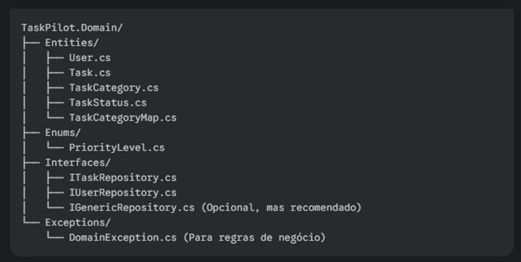
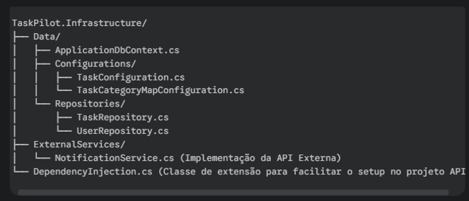
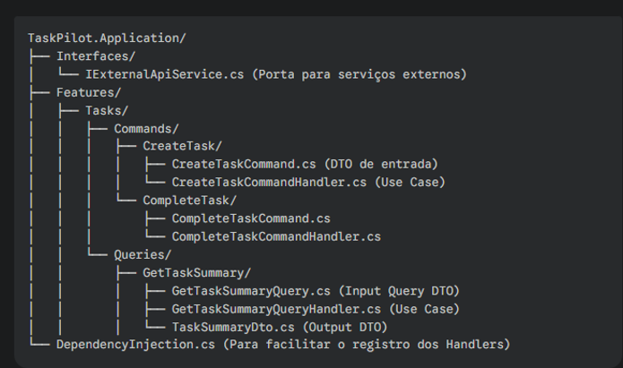

# Sistema gerenciador de tarefas (Simples)

Projeto: Sistema de Gerenciamento de Tarefas com Análise de Produtividade

# Banco de dados (MER)

Será utlizado T-SQL seguindo a modelagem abaixo:

# Arquitetura da aplicação

## TaskPilot.Domain

## TaskPilot.Infraestructure

## TaskPilot.Application

