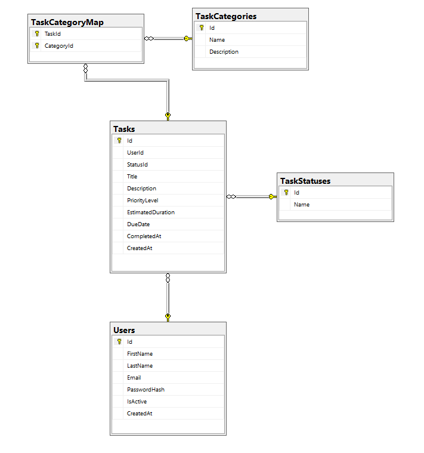

# 🚀 TaskPilot API

O TaskPilot é uma API RESTful desenvolvida em ASP.NET Core que gerencia tarefas e usuários. O projeto segue os princípios da Arquitetura Limpa (Clean Architecture) e utiliza padrões modernos de desenvolvimento, como CQRS (Command Query Responsibility Segregation), para garantir separação de responsabilidades, escalabilidade e manutenibilidade.

## 📐 Arquitetura do Projeto (Clean Architecture / CQRS)

O projeto está estruturado em quatro camadas principais, com dependências fluindo estritamente de fora para dentro (API -> Application -> Domain).

### 1. TaskPilot.API (Apresentação)
- **Função:** Ponto de entrada das requisições HTTP. Responsável pelo roteamento, serialização JSON e tratamento global de exceções (Middleware).
- **Controladores:** Possuem a lógica mínima (`Thin Controllers`), injetando os **Serviços de Aplicação** (`IUserService`, `ITaskService`) ou o **IMediator** (se você optar por MediatR no futuro) para delegar a execução.
- **Não Conhece:** A lógica de negócio, acesso a dados ou regras de domínio.

### 2. TaskPilot.Application (Aplicação / Lógica de Negócio)
- **Função:** Contém a lógica de negócio do sistema (o "O quê" e o "Como" do sistema).
- **Padrão Utilizado:** **Service Layer** (Camada de Serviço).
    - Interfaces (`IUserService`, `ITaskService`) e Implementações (`UserService`, `TaskService`) que orquestram a lógica, validam e usam os Repositórios.
- **Objetos:** Data Transfer Objects (DTOs), Command/Query Objects.

### 3. TaskPilot.Domain (Domínio / Regras de Negócio)
- **Função:** Contém as regras de negócio centrais, entidades, exceções de domínio e contratos.
- **Conteúdo:** Entidades (`User`, `Task`), Interfaces de Repositório (`IUserRepository`, `ITaskRepository`) e Exceções customizadas (`DomainException`).
- **Não Conhece:** Nada sobre a aplicação (API, Services) ou infraestrutura (Banco de Dados).

### 4. TaskPilot.Infrastructure (Infraestrutura / Acesso a Dados)
- **Função:** Implementação de contratos e serviços externos.
- **Conteúdo:** Implementação dos Repositórios (`UserRepository`, `TaskRepository`), configuração do Entity Framework Core (`ApplicationDbContext`) e Strings de Conexão.
- **Tecnologia:** Entity Framework Core (EF Core) para acesso a dados.

---

## 💾 Modelagem do Banco de Dados (Entidades Principais)

A API utiliza um banco de dados relacional (SQL Server por padrão) gerenciado pelo Entity Framework Core. O modelo de domínio é simples, com as seguintes entidades:

| Entidade | Propriedade | Tipo | Descrição |
| :--- | :--- | :--- | :--- |
| **User** | `Id` | `int` | Chave primária. |
| | `Username` | `string` | Nome de login do usuário. |
| | `Email` | `string` | Email do usuário (único). |
| | `PasswordHash` | `string` | Hash da senha (segurança). |
| **Task** | `Id` | `int` | Chave primária. |
| | `Title` | `string` | Título breve da tarefa. |
| | `Description` | `string` | Descrição detalhada. |
| | `CreatedAt` | `DateTime` | Data de criação. |
| | `DueDate` | `DateTime` | Prazo final. |
| | `IsCompleted` | `bool` | Status da tarefa (padrão: `false`). |
| | `UserId` | `int` | **Chave Estrangeira** (`FK`) para o usuário proprietário. |

**Relacionamento:** `User` 1 : N `Task` (Um usuário pode ter muitas tarefas).

## Modelagem completa: Entidade e relacionamento (MER) 

<p align="center">
  
</p>

---

## ⚙️ Executando o Projeto Passo a Passo

Siga estas etapas para configurar e executar a API localmente:

### Pré-requisitos:

1.  **SDK .NET Core 3.1** (A framework alvo do projeto)
2.  **SQL Server** (ou SQL Express LocalDB)
3.  **Python 3.x** 
4.  **Git**
5.  **Editor de Código** (Visual Studio ou VS Code)

### Passo 1: Clonar o Repositório

```bash

git clone [https://github.com/JTBCode86/gerenciador-de-tarefas.git]

cd TaskPilot

```

### Passo 2: Configurar a Conexão com o Banco de Dados

1. Abra o arquivo TaskPilot.API/appsettings.json.
2. Localize a seção ConnectionStrings.
3. Configure a string de conexão DefaultConnection para apontar para o seu SQL Server local ou instância do LocalDB.

``` Jason
    "ConnectionStrings": {
        "DefaultConnection": "Server=(localdb)\\mssqllocaldb;Database=TaskPilotDB;Trusted_Connection=True;MultipleActiveResultSets=true"
        // Altere esta linha conforme sua configuração de banco de dados!
    }
```

### Passo 3: Aplicar Migrations do Entity Framework Core

O projeto utiliza migrations para criar e atualizar o schema do banco de dados.

1. Abra um terminal na pasta raiz da solução (TaskPilot/).
2. Execute o comando para aplicar as migrations pendentes e criar o banco de dados:

```bash
    dotnet ef database update --project TaskPilot.Infrastructure
```

### Passo 4: Executar a Aplicação

1. Navegue até o diretório do projeto da API:

```bash
    cd TaskPilot/TaskPilot.API
```

A API deve iniciar e estará rodando em https://localhost:5001 (Verifique a saída do console para confirmar a porta).

2. Execute a aplicação:

```bash
    dotnet run
```
### Passo 5 Verificar o Swagger: Abra seu navegador e acesse a documentação interativa para confirmar que a API está no ar:

```bash
https://localhost:5001/swagger
```

### Passo 6: Acessar a Documentação (Swagger)

A API estará rodando em uma porta local (verifique o launchSettings.json, geralmente http://localhost:5000 ou https://localhost:5001).

Acesse a documentação interativa (Swagger UI) no seu navegador:

http://localhost:[Porta_API]/swagger

### Passo 7: Configurar e Executar o Cliente Python

1. Instalar Dependências Python: Abra um novo terminal e navegue até a pasta do cliente Python (ajuste o caminho se necessário):

```bash
cd [Caminho para TaskPilot]/src/taskpilot_client
pip install requests
```

2. Configurar a URL da API no Python: Abra o arquivo main.py e configure a variável API_BASE_URL para corresponder à sua API (baseado no seu último teste, é o HTTPS):

```bash
# main.py
API_BASE_URL = "https://localhost:5001" 
USER_ID_TO_FETCH = 1  # ID do usuário existente no seu DB
```

3. Executar o Script Python: Execute o cliente Python para testar os casos de uso (Busca, Criação e Conclusão de Tarefas):

```bash
python main.py
```

4. Verificar a Saída: O console Python deve exibir:

✅ Tarefa criada com sucesso. ID: [número]

✅ Tarefa ID [número] encerrada com sucesso.

O Resumo de Tarefas final, mostrando a tarefa recém-criada com o status COMPLETA.